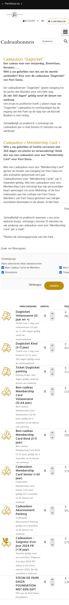
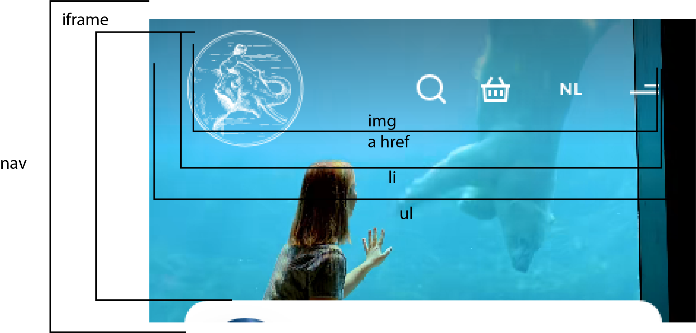

# Procesverslag
Markdown is een simpele manier om HTML te schrijven.  
Markdown cheat cheet: [Hulp bij het schrijven van Markdown](https://github.com/adam-p/markdown-here/wiki/Markdown-Cheatsheet).

Nb. De standaardstructuur en de spartaanse opmaak van de README.md zijn helemaal prima. Het gaat om de inhoud van je procesverslag. Besteedt de tijd voor pracht en praal aan je website.

Nb. Door *open* toe te voegen aan een *details* element kun je deze standaard open zetten. Fijn om dat steeds voor de relevante stuk(ken) te doen.

## Jij

  
uitwerken voor kick-off werkgroep

  ### Auteur:
  Chanel Vercaemst (vervangen door jouw naam)

  #### Je startniveau:
  blauwe piste met een beetje rode piste (kies uit zwart, rood óf blauw)

  #### Je focus:
  surface plane (kies uit responsive óf surface plane)
 

## Je website

  
uitwerken voor kick-off werkgroep

  ### Je opdracht:
  link naar de website die je gaat namaken óf de naam/omschrijving van je eigen ontwerp: https://www.pairidaiza.eu/nl/

  #### Screenshot(s) van de eerste pagina (small screen): 
  hier de naam van de pagina  
  

  #### Screenshot(s) van de tweede pagina (small screen):
  hier de naam van de pagina  
  
 

## Toegankelijkheidstest 1/2 (week 1)

  
uitwerken na test in 2e werkgroep

  ### Bevindingen
  Lijst met je bevindingen die in de test naar voren kwamen:
  Eigen website (Pairi Daiza)
  - Verschillende buttons hebben niet een betekenis gekregen, dus weet de gebruiker niet wat de button voor functie heeft in de navigatie.
  - De galerij met slider krijgt geen duidelijke naam en de gebruiker weet niet dat het een galerij is waar je door kan schuiven naar rechts.
  - Heel veel afbeeldingen worden zo maar overgeslagen.
  - De afbeeldingen hebben ook geen uitleg over wat er te zien is op de afbeeldingen.
  - Het is best wel lastig met de sneltoetsen te navigeren om alles te horen.
  - De structuur van de website via de screenreader klopt wel van boven naar beneden.
 

  

  

  

  

Ingmar's website (Hema)
  - De navigatie klopt maar de reader gaat eerst naar het logo terwijl er nog linkjes boven staan.
  - Wanneer de reader bij het winkelmandje komt begint hij gelijk over het inloggen, terwijl dat nog nergens te zien is op de website.
  - Hij raakt helemaal in de war bij het begin.
  

## Breakdownschets (week 1)

  
uitwerken na afloop 3e werkgroep

  ### de hele pagina: 
  
  
  

  ### dynamisch deel (bijv menu): 
  

  ### wellicht nog een dynamisch deel (bijv filter): 
  

## Voortgang 1 (week 2)

  
uitwerken voor 1e voortgang

  ### Stand van zaken
  Het ging vooral lastig met de h1 en h2 aanduiden, want ik helemaal naar de h6.
  Ik weet niet waarom ik zo veel lijstjes heb.

  ### Agenda voor meeting
  samen met je groepje opstellen

  | student 1      | student 2          | student 3    | student 4        |
  | ---            | ---                | ---          | ---              |
  | dit bespreken  | en dit             | en ik dit    | en dan ik dat    |
  | en dat ook nog | dit als er tijd is | nog een punt | dit wil ik zeker |
  | ...            | ...                | ...          | ...              |
    Hamburgermenu

  ### Verslag van meeting
  hier na afloop snel de uitkomsten van de meeting vastleggen

  - hamburgermenu, zeker de oefening doen die het meest op je eigen menu lijkt.
  - goed opgebouwde semantische html, goede omkadering van html doet al het meeste.
  - toegankelijkheidstest mag uitgebreider.
  - alles uitklappen en dat in de html zetten.
  - Niet alles hoeft in lijstjes.
  - H1 mag toegevoegd worden, je kan display none. Je kan hem in een boxje. paginatitel is wel fijn voor de screenreader.
  - H2 kunnen apart gestyled worden met class.
  - H3 is alleen wanneer in h2 er weer een ander onderdeel.
  - Classes gebruiken waar het logisch, correct is en waar je niks anders kan gebruiken.
  - img:nth of type (odd/even) kan ook voor even en oneven img, ...

## Voortgang 2 (week 3)

  
uitwerken voor 2e voortgang

  ### Stand van zaken
  Verschillende css die ik doe, gaat ook op andere h2 bijvoorbeeld en dan moet ik die een class geven maar soms veranderde die andere h2 toch niet en dat zorgde best wel voor veel tijd verlies.

  Het maken van het menu onder de video was best wel een uitdaging waar ik toch meer dan een half uur aan heb gezeten samen met Diego. 

  Dingen zoals de nav ging best oke, alleen heb ik een dropdown menu die ik nog moet stylen.

  De footer ging ook best goed, ik moet wel nog iedere details stylen.

  Daarnaast heb ik 3 verschillende carousels en de tweede ging goed, maar de eerste heeft bolletjes onder de carousel maar dat wil maar niet lukken en ik weet echt niet waar ik een goede handleiding hiervoor kan vinden.
  Daarnaast is de derde carousel een automatische die in een loop doorloopt maar dat kan ik ook niet vinden.

  Ik moet ook nog het hamburgermenu maken.

  Ik moet nog de css doen voor de tweede pagina maar ik denk dat dat makkelijker zal verlopen. Het zal eerder de animatie zijn voor het winkelmandje waar ik mee ga zitten.
  

  ### Agenda voor meeting
  samen met je groepje opstellen

  | student 1      | student 2          | student 3    | student 4        |
  | ---            | ---                | ---          | ---              |
  | dit bespreken  | en dit             | en ik dit    | en dan ik dat    |
  | en dat ook nog | dit als er tijd is | nog een punt | dit wil ik zeker |
  | ...            | ...                | ...          | ...              |

  ### Verslag van meeting
  hier na afloop snel de uitkomsten van de meeting vastleggen

  - css clip-path maker voor hamburgermenu vanuit een hoek.
  - main een class geven zo om makkelijk te stylen voor de tweede pagina.
  - een tutorial gekregen om mijn carousel automatisch te maken van David.
  - 

## Toegankelijkheidstest 2/2 (week 4)

  
uitwerken na test in 9e werkgroep

  ### Bevindingen
  Lijst met je bevindingen die in de test naar voren kwamen (geef ook aan wat er verbeterd is):

  

## Voortgang 3 (week 4)

  
uitwerken voor 3e voortgang

  ### Stand van zaken
  1. Bij de footer is er een vierkant waar je op 4 verschillende links kan klikken. Het lukt me niet met grid om de pijl en de tekst op de juiste plaats te zetten.
  
  2. De automatische carousel gaat automatisch maar de list items willen niet dupliceren en zo in loop afspelen en ook de carousel neemt meer dan de grootte van het scherm in.
   
  3. ik heb ook nog een inschrijvingsformulier die ik moet maken die ik bijna vergeten was.
  4. de tweede pagina moet ik nog de nav in de footer aanpassen en het winkelmandje een animatie geven wanneer iets toevoegd aan je winkelmandje.
  5. light en dark mode moet ik nog toevoegen.
  6. Ik ga ook nog aan de video toevoegen dat er kan gekozen worden om de video te pauzeren.
  7. de reduced motion wil ik ook nog toevoegen aan mijn website.
  8. Als laatste heb ik nog de eerste carousel die bolletjes moet hebben eronder om te kunnen klikken naar een afbeelding in de carousel.

  ### Agenda voor meeting
  samen met je groepje opstellen

  | student 1      | student 2          | student 3    | student 4        |
  | ---            | ---                | ---          | ---              |
  | dit bespreken  | en dit             | en ik dit    | en dan ik dat    |
  | en dat ook nog | dit als er tijd is | nog een punt | dit wil ik zeker |
  | ...            | ...                | ...          | ...              |

  ### Verslag van meeting
  hier na afloop snel de uitkomsten van de meeting vastleggen

  - carousel met bolletjes zijn er daar goeie tutorials voor?
  - de automatische carousel is er iets dat niet klopt waardoor het niet werkt?
  - de tweede pagina mag die wat simpeler zijn?
  - 

## Eindgesprek (week 5)

  
uitwerken voor eindgesprek

  ### Je uitkomst - karakteristiek screenshots:
  

  ### Dit ging goed/Heb ik geleerd: 
  Korte omschrijving met plaatjes

  

  ### Dit was lastig/Is niet gelukt:
  Korte omschrijving met plaatjes

  

## Bronnenlijst

  
continu bijhouden terwijl je werkt

  Nb. Wees specifiek ('css-tricks' als bron is bijv. niet specifiek genoeg). 
  Nb. ChatGpT en andere AI horen er ook bij.
  Nb. Vermeld de bronnen ook in je code.

  1. het dropdown menu waar je kan kiezen tussen verschillende talen enzovoort, heb dit gevonden door de developer tools van Mozilla Firefox. https://developer.mozilla.org/en-US/docs/Web/HTML/Element/select 
  2. De checkbox heb ik ook gevonden in de developer tools van Mozilla Firefox. https://developer.mozilla.org/en-US/docs/Web/HTML/Element/input/checkbox 
  3. Het menu onder de video heb ik hulp bij gekregen van Diego om hier te werken met grid.
  4. Voor de carousel puur in css heb ik deze code gevolgd. https://www.nieknijland.nl/blog/make-a-responsive-carousel-with-just-css
  5. Voor de gradient op de tijger foto heb ik hulp gekregen van de sutdentenassistent. https://codepen.io/Dave-deo/pen/rNEEEWr?editors=1100 
  6. Voor het stylen van de details en summary in de footer heb ik deze code gebruikt. https://www.sitepoint.com/style-html-details-element/ 
  7.  Hamburgermenu laten verschijnen en verdwijnen via javascript. https://www.w3schools.com/howto/howto_js_toggle_hide_show.asp
  8. https://youtu.be/iLmBy-HKIAw?si=-56qVNNYvvBA1AkZ deze tutorial heb ik gevolgd voor de automatische carousel.

